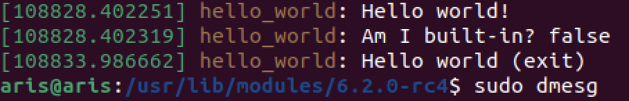

# Module development
This document gives a general overview of the process of developing the Linux kernel modules, specifically loadable ones (LKMs). It implements a simple example of an LKM in Rust.

## 1. Create a module `.rs` file
In the directory of `linux-<..>/samples/rust` create a simple Hello world module by adding the file `<module_name>.rs` (e.g. `hello_world.rs`) with the following sample code, which you can also find in [this repository][].
```
//! Rust Hello world sample.

use kernel::prelude::*;

module! {
    type: HelloWorld,
    name: "hello_world",
    license: "GPL",
}

struct HelloWorld;

impl kernel::Module for HelloWorld {
    fn init(_module: &'static ThisModule) -> Result<Self> {
        pr_info!("Hello world!\n");
        pr_info!("Am I built-in? {}\n", !cfg!(MODULE));

        Ok(HelloWorld)
    }
}

impl Drop for HelloWorld {
    fn drop(&mut self) {
        pr_info!("Hello world (exit)\n");
    }
}
```

## 2. Update `Kconfig`
To include the created module, add the configuration entry in `Kconfig`
```
config SAMPLE_RUST_HELLO_WORLD
	tristate "Hello world"
	help
	  This option builds the Rust Hello world sample.

	  To compile this as a module, choose M here:
	  the module will be called hello_world.

	  If unsure, say N.
```
Note: make sure to use the same module naming across the files/system.

## 3. Update `Makefile`
Add the entry in `Makefile`
```
obj-$(CONFIG_SAMPLE_RUST_HELLO_WORLD)		+= hello_world.o
```

## 4. Re-run `make modules modules-install`
Enable loadable modules by typing `m`.

## 5. Test the module

### 5a. Load/unload the module
Using `modprobe` (or `insmod`/`rmmod` from the kernel object location under `/lib/modules/$(uname -r)`) on the module:
- to load (insert)
```
sudo modprobe <module_name>
```
- to unload (remove)
```
sudo modprobe -r <module_name>
```

### 5b. Check kernel dump
To see the kernel buffer and the printed `Hello world` run
```
sudo dmesg
```
You should see the messages at the bottom
